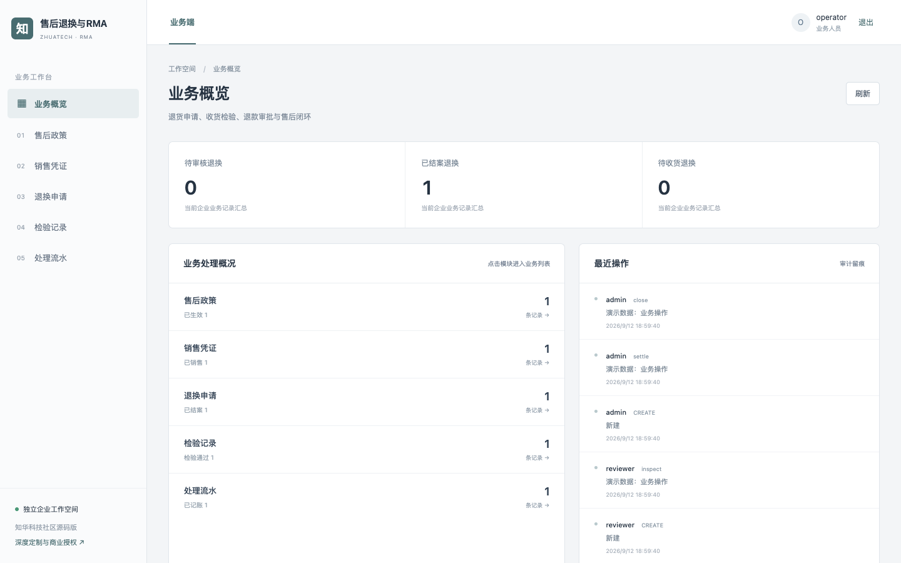
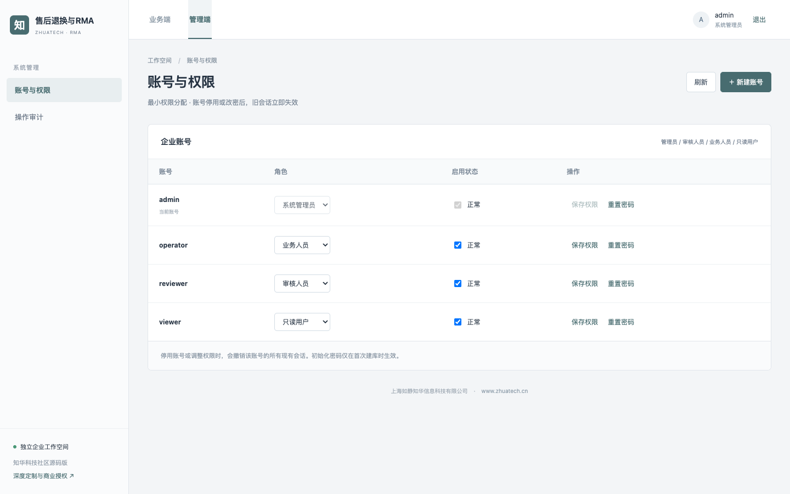
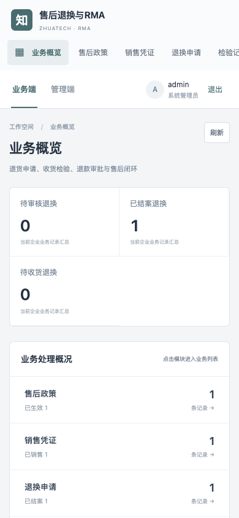

# 知华售后退换与 RMA（zhuatech-rma）

> 上海如静知华信息科技有限公司推出的企业售后退换管理公开源码版。面向退货、换货、质保及退款审批场景。

从销售凭证到售后结案，流程是：**政策与销售登记 → 退换申请 → 独立审核 → 收货检验 → 退款/换货登记 → 结案**。业务动作写入 MySQL，拒绝分支不会生成虚假流水。

## 已实现的业务

| 模块 | 核心能力 |
| --- | --- |
| 售后政策 | 无理由退货期和质量保修期，已有销售引用时冻结政策历史。 |
| 销售凭证 | 订单号＋SKU 唯一，记录购买时间、数量、单价和适用政策。 |
| 退换申请 | 校验申请日期、政策时效与可退数量；支持拒绝、通过、分批收货、检验通过/失败。每次收货必须填写唯一收货凭证号，累计数量不能超过申请数量。 |
| 检验与处理流水 | 检验结果只追加；退款金额按成交单价×数量计算，处理凭证号去重；换货保存数量与处理单号。 |
| 管理与追溯 | 角色授权、审核人与提交人分离、附件、变更历史、审计、CSV 导出、幂等与并发版本校验。 |

举例：一笔 2 件、单价 100 元的订单，申请退 1 件；通过审核、收货和检验后，结算流水记录 100 元退款。再申请 2 件会因超出剩余可退数量被拒绝。此规则已纳入 HTTP 验收用例。

若客户分两次寄回商品，收货员可分别登记数量与凭证号；未收齐时退换申请停留在“部分收货”，不得提前检验或退款。两次收齐后才进入检验环节，收货流水可逐笔追溯。重复凭证、超量收货均被事务性拒绝。



管理端账号与权限设置：



移动 H5 工作台：



### 范围说明

系统登记退款/换货凭证并完成内部审批，不会直接调用银行或支付平台扣/退款；真实资金划拨与 ERP/WMS 对接需在授权实施时接入并联调。

## 运行与验证

需要 Docker Compose。复制 `.env.example` 为 `.env`，分别设置 MySQL 与四种角色的独立强密码，然后执行：

```bash
docker compose up -d --build
sh scripts/test.sh
```

业务端与管理端共用 `http://127.0.0.1:8088`（管理入口 `/admin`）；后端健康检查为 `http://127.0.0.1:18080/api/health`。四个初始化账号为 `admin`、`reviewer`、`operator`、`viewer`，密码从环境变量读取。端口可通过 `WEB_PORT`、`API_PORT` 调整。可使用 `.env.demo.example` 做**仅本机**演示，但切勿连接真实业务数据库或向公网开放演示密码。

后端采用 Java 21 / Spring Boot 4 / MySQL 8.4 / Flyway；前端采用 Vue 3 / Vite，适配桌面与 H5。CI 在 MySQL 上运行后端测试；本机脚本默认用 H2 MySQL 兼容模式跑后端验收，再跑前端单测及生产构建。完整验收脚本见 `backend/src/test/resources/acceptance.json`。

## 使用边界与授权

本仓库是可运行的公开源码学习交流版本，**不是 OSI 意义的开源许可**。根据 [LICENSE](LICENSE)，源码仅限个人非商业学习、研究和交流。企业内部生产、客户交付、SaaS、收费服务及其他商用均须先取得上海如静知华信息科技有限公司书面授权。生产上线还需要企业自己的安全评估、备份恢复、合规与业务参数验收。

[知华科技官网](https://www.zhuatech.cn/)提供中小企业信息化、AI 转型、OPC 技术支持、软件项目外包、实施、FDE 外包与深度开发定制咨询。也可扫码添加微信咨询：

| 微信咨询一 | 微信咨询二 |
| --- | --- |
|  |  |

版权及项目维护：上海如静知华信息科技有限公司 · https://www.zhuatech.cn/
